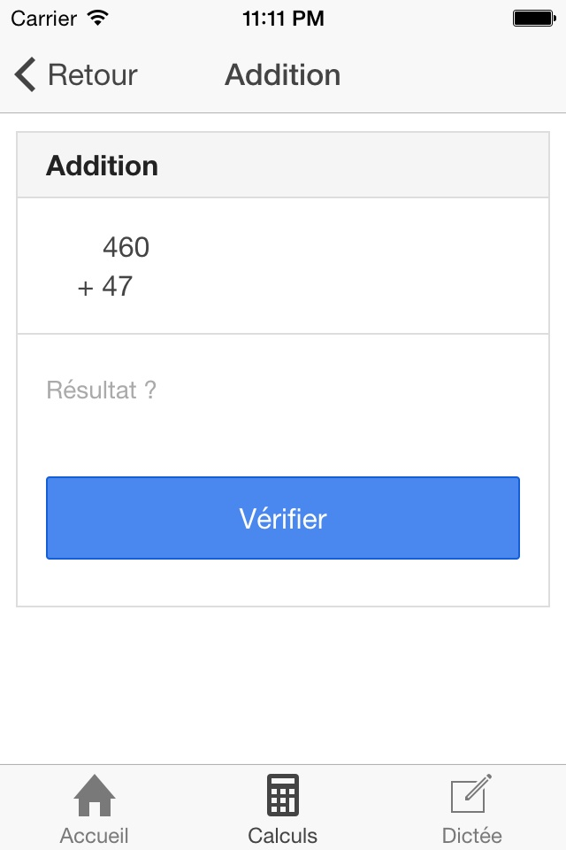

# Compiti

`compiti`: _m._ _pl._ homework assignments 



## How-to

Available on iOS / Android / Web thanks to [Ionic framework](http://ionicframework.com/)

```bash
$ npm install -g cordova ionic
$ git clone https://github.com/ronanguilloux/Compiti.git
$ cd Compiti
$ ionic platform add ios
$ ionic build ios
$ ionic emulate ios
```

## Known issues

### `no such file or directory '/plugins/ios.json' ionic`

Solution:

```bash
$ cordova plugin add org.apache.cordova.device
```

### `Cordova needs ios-sim version 1.7 or greater, you have version .`

Solution:

```bash
$ sudo brew uninstall ios-sim
$ sudo npm install ios-sim -g
```


## Licence

- Source code: MIT License
- Ionic Framework: MIT License
- AngularJs Framework: MIT License
- Apache Cordova: Apache License, version 2.0
- iOS: Apple Proprietary EULA License, except for open-source components
- Android: Apache 2.0 & GNU GPL 2 Licenses
- Ionicons: MIT License
- ["Patrick Hand" webfont](http://www.google.com/fonts/specimen/Patrick+Hand), by [Patrick Wagesreiter](https://plus.google.com/111107509148784591183/about): SIL Open Font License, 1.1
